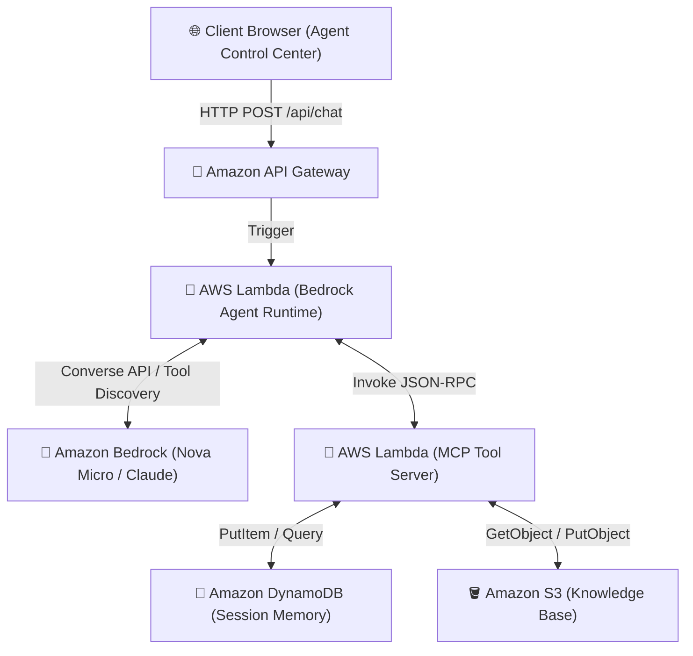

# 🚀 Enterprise Agentic AI Control Center | AWS Bedrock & Model Context Protocol (MCP)


-06B6D4?style=for-the-badge)


Production-grade **Agentic AI Control Center** leveraging **Amazon Bedrock (Amazon Nova Micro / Anthropic Claude)**, **Model Context Protocol (MCP)**, **AWS Lambda**, and **Amazon DynamoDB** for autonomous session memory persistence and tool execution.

---

## 🌟 Key Features

- **🧠 Amazon Bedrock Reasoning Engine**: Powered by **Amazon Nova Micro** (`us.amazon.nova-micro-v1:0`) for ultra-fast, low-cost multi-turn agent reasoning (< 1.5s latency).
- **🔌 Model Context Protocol (MCP) Decoupling**: Full implementation of MCP JSON-RPC standard (`tools/list` & `tools/call`), decoupling LLM prompts from database tools. Zero vendor lock-in!
- **💾 Autonomous DynamoDB Memory**: Pay-Per-Request session memory table with automatic 24-hour TTL expiration.
- **🚀 1-Click Infrastructure-as-Code (IaC)**: Deploy and teardown the entire AWS stack (IAM Roles, Lambda Functions, DynamoDB, API Gateway) via CloudFormation directly from the UI.
- **⚡ Dual Mode Execution**: Seamlessly switch between **`🌐 Live AWS Mode`** and **`⚡ Demo Simulation Mode`** (no AWS credentials required for testing).
- **💻 Complete Code Inspector**: Built-in interactive code viewer for CloudFormation YAML, Lambda Agent Runtime Python, MCP Tool Server Python, and MCP JSON-RPC specs.

---

## 🗺️ System Architecture



---

## ⚙️ Prerequisites & AWS Configuration

### 1. Required AWS IAM Permissions
To run live deployments and interact with Amazon Bedrock, your AWS IAM Access Key requires the following policy actions:
- `bedrock:InvokeModel`, `bedrock:InvokeModelWithResponseStream`
- `lambda:InvokeFunction`, `lambda:CreateFunction`, `lambda:DeleteFunction`
- `dynamodb:*` (On-Demand tables)
- `cloudformation:*` (Stack creation & update)
- `apigateway:*` (REST API management)

### 2. AWS Region Selection
Ensure your IAM user has access to Amazon Bedrock models. Recommended region:
- **`us-east-1`** (N. Virginia) — Full support for Amazon Nova Micro and Anthropic Claude models.

---

## 🚀 Quickstart: Running Locally

### Step 1: Clone Repository
```bash
git clone https://github.com/ved-agentic-ai/ai-aws-bedrock-mcp-agent.git
cd ai-aws-bedrock-mcp-agent
```

### Step 2: Install Python Dependencies
```bash
python -m pip install boto3 python-pptx
```

### Step 3: Launch Local Web Server
```bash
python server.py
```

### Step 4: Open Control Center in Browser
Navigate to:
```text
http://127.0.0.1:3000
```

---

## 💻 Web App & Live AWS Configuration Guide

### 1. Setting Up AWS Credentials in UI
1. Click **`⚙️ AWS Config`** in the top header.
2. Either **drag and drop your `credentials.csv`** file or manually paste your `AWS Access Key ID` and `AWS Secret Access Key`.
3. Click **`💾 Save & Remember`**. Credentials are encrypted in browser local storage.

### 2. Deploying Live AWS Infrastructure (1-Click)
1. Click **`🚀 Live AWS Deploy`** in the header.
2. Watch the realtime CloudWatch log stream as AWS CloudFormation provisions the full stack (~15 seconds).
3. The API Gateway Endpoint URL will be auto-detected and configured.

### 3. Testing Agentic MCP Tools
- **Save Session Memory**: Click `💾 Save Session (MCP Tool)` -> Bedrock reasons and calls `save_session_data` MCP tool on DynamoDB.
- **Query Session Memory**: Click `🔍 Query DynamoDB` -> Bedrock reasons and calls `query_database` MCP tool to retrieve session state.
- **General AI Questions**: Type any prompt (e.g. *"Write a Python script for quicksort"*) -> Bedrock responds in direct conversational ChatGPT-style.

### 4. Stack Teardown (Zero Cost Cleanup)
When finished testing, click **`🔥 Stack Teardown`** to immediately delete all AWS resources and maintain **$0 idle cost**.

---

## 📂 Codebase Structure

```text
├── server.py                     # Multi-threaded WSGI Python Backend Server (Port 3000)
├── index.html                    # Single-Page App (Glassmorphism UI, SVG Architecture, Code Inspector)
├── bedrock-mcp-stack.yaml        # CloudFormation IaC (Bedrock Agent, MCP Server, DynamoDB, S3, IAM)
├── generate_powerpoint.py        # Automated PowerPoint Slide Deck Generator (.pptx)
├── aws_bedrock_mcp_presentation.md # Technical Slide Deck Markdown Presentation
├── linkedin_showcase_post.md     # Production-Ready Technical LinkedIn Post Draft
├── README.md                     # Master Documentation
└── .gitignore                    # Version Control Exclusions
```

---

## 🤝 Protocol Specification (MCP Standard)

### Tool Discovery (`tools/list`)
```json
{
  "tools": [
    {
      "name": "query_database",
      "description": "Query session history or stored state from DynamoDB",
      "input_schema": {
        "type": "object",
        "properties": {
          "session_id": { "type": "string" }
        },
        "required": ["session_id"]
      }
    }
  ]
}
```

### Tool Invocation (`tools/call`)
```json
{
  "action": "tools/call",
  "name": "save_session_data",
  "arguments": {
    "session_id": "session_101",
    "content": "Purchased Prime Upgrade"
  }
}
```

---

## 📄 License
Distributed under the MIT License. See `LICENSE` for more information.
